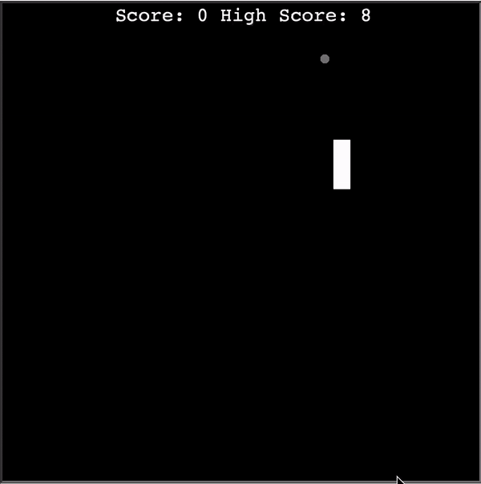

# Snake_game

A classic Snake Game implemented in Python.

## Description

The Snake Game is a simple yet entertaining game where the player controls a snake that grows longer as it consumes food. The objective is to guide the snake to eat as much food as possible without colliding with itself or the walls.

## Preview

## Installation

1. Clone the repository: git clone https://github.com/YourUsername/Snake_Game.git
2. Navigate to the project directory: cd Snake_game

## Usage

1. Run the game: python snake_game.py
2. Use the arrow keys to control the snake.

## Features

- Classic snake game with intuitive controls.
- Smooth and responsive gameplay.
- Dynamic snake movement with adjustable speed.
- Randomized food generation for added challenge.
- Score tracking and high score display.
- Game over detection and restart functionality.
- Colorful visuals and appealing graphics.
- Sound effects for enhanced gaming experience.
- Customizable settings for tail color, game speed, etc.
- Supports keyboard arrow keys for movement.

## Technologies Used
- Python
- Object-Oriented Programming (OOP)

## License

This project is licensed under the [MIT License](LICENSE).

## Acknowledgments

The project is part of the "100 Days of Code: The Complete Python Pro Bootcamp for 2023" course on Udemy by Dr. Angela Yu.
